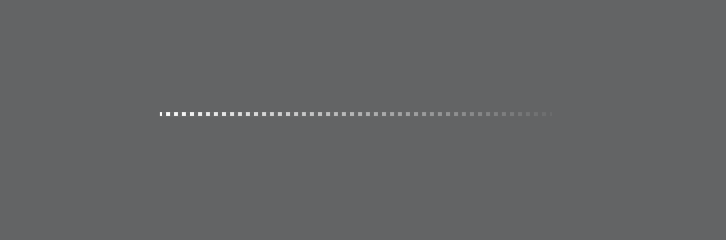

# 渐变虚点线



```css
<!--虚点线元素容器-->
body {
    background-color: #636465;
    position: relative;
    height: 100vh;
}

.demo {
    width: 200px;
    height: 0;
    <!--设置需要呈现的虚点线的渐变色-->
    background: linear-gradient(46deg, rgba(255, 255, 255, 1) 0%, rgba(255, 255, 255, 0.04) 100%);
    position: absolute;
    left: 50%;
    top: 50%;
    transform: translateX(-50%) translateY(-50%);
    <!--背景色从边框开始填充-->
    background-origin: border-box;
    <!--边框颜色与容器背景色一致-->
    border-bottom: 2px dotted #636465;
}
```
