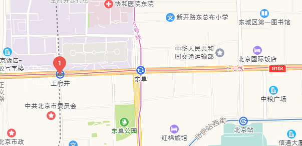

# 画自定义mark



> 以下基于高德地图

```js
// js
var cpoint = [116.411568,39.908071]; //地图中心点坐标
var centerpointer = new AMap.LngLat(cpoint[0],cpoint[1]);

var map = new AMap.Map(dom , {
    resizeEnable: true,
    zoom: 11, //初始化地图层级
    center: cpoint, //初始化地图中心点
    // ... 其他参数
})

function drawMark(map,center,content,otherConfig={}){
    var marker = new AMap.Marker({
        map: map,
        zIndex:200,
        anchor:'bottom-center', // 设置锚点方位
        position: center, //基点位置
        //相对于基点的偏移位置
        // 因为水滴样式底部的伪类样式超过容器底部14像素，此处设置一个偏移量（具体设置依据实际情况）
        offset: new AMap.Pixel(0, -14), 
        content: content,   //自定义点标记覆盖物内容
        ...otherConfig //其他定制化设置
    });
    marker.setMap(map);  //在地图上添加点
    return marker
}


var content = '<div class="dropmarker">' + 1 + '</div>'

drawMark(map,centerpointer,content)
```

```scss
// scss
// 样式仅做示例，可根据实际情况调整
// 地图标记物
// 水滴标记
.dropmarker{
    width: 26px;
    height: 26px;
    border-radius: 50%;
    background: #EC564C;
    line-height: 26px;
    text-align: center;
    color: white;
    &:after {
        content: '';
        width: 0px;
        height: 0px;
        border: 10px transparent solid;
        position: absolute;
        bottom: -20px;
        left: 50%;
        transform: translateX(-50%);
        border-right: 10px solid transparent;
        border-top: 15px solid #EC564C;
        border-left: 10px solid transparent;
    }
    &::before{
        content: '';
        width: 16px;
        height: 6px;
        background-color: rgba($color: #6E6E6C, $alpha: 0.8);
        border-radius: 12px / 5px;
        position: absolute;
        left: 50%;
        transform: translateX(-50%);
        bottom: -14px;
    }
}
```