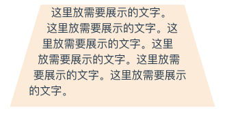

# 不规则内容显示

```html
<div class="box">
    <div class="left"></div>
    <div class="right"></div>
    <p>这里放需要展示的文字。这里放需要展示的文字。这里放需要展示的文字。这里放需要展示的文字。这里放需要展示的文字。这里放需要展示的文字。</p>
</div>
```

```css
.box {
    width: 300px;
    height: 150px;
    margin: 0 auto;
    background-color: antiquewhite;
    text-align: left;
    position: relative;
    clip-path: polygon(85% 0, 100% 100%, 0 100%, 15% 0);
}
.left,
.right {
    width: 20%;
    height: 100%;
}
.left {
    float: left;
    shape-outside: polygon(100% 0, 30% 100%, 0 100%, 0 0);
}
.right {
    float: right;
    shape-outside: polygon(0 0, 100% 0, 100% 100%, 80% 100%);
}
```

> 具体应用可根据实际需要灵活调整