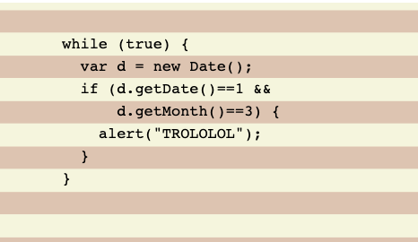

# 文本行的斑马条纹



```css
/* css */
pre{
    padding: .5em;
    line-height: 1.5;
    background: beige;
    background-image: linear-gradient(rgba(120,0,0,.2) 50%, transparent 0);
    background-size: auto 3em;
    background-origin: content-box;
    tab-size: 2;
}
```

```html
<!-- html -->
<pre>
    <code>
        while (true) {
            var d = new Date();
            if (d.getDate()==1 &amp;&amp;
                d.getMonth()==3) {
                alert("TROLOLOL");
            }
        }
    </code>
</pre>
```