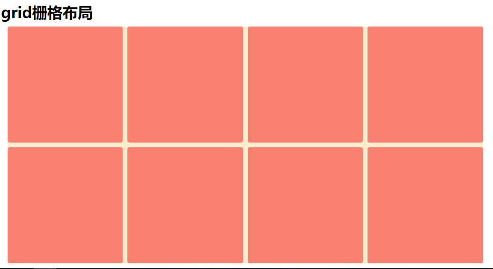

# Grid布局实现列表等分排列

```css
.list-wrap{
    display: grid;
    grid-template-columns:repeat(4,1fr);
    grid-gap: 10px;
}
.list-wrap .listItem{
    background-color: salmon;
    border-radius: 4px;
}
```

```html
<ul class="list-wrap">
    <li class="listItem"></li>
    <li class="listItem"></li>
    <li class="listItem"></li>
    <li class="listItem"></li>
    <li class="listItem"></li>
    <li class="listItem"></li>
    <li class="listItem"></li>
    <li class="listItem"></li>
</ul>
```

效果：
